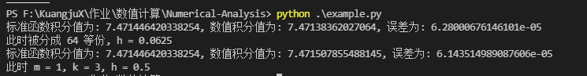

# 数值积分

## 实验内容
实现复化梯形公式和龙贝格算法计算积分，并完成两种方法之间的精度对比。输入函数区间 $[a,b]$, 被积函数 $f(x) = \sqrt{x}lnx$, 参数 $h$ 作为步长。参数 $\varepsilon$ 作为要求满足的精度条件。要求取不同的步长 $h$, 要求用复化梯形公式和龙贝格公式分别计算积分值。计算当精度到达 $\varepsilon$ 的时候，所需要等分积分区间的次数(假设每次都是二等分)及 h 的大小。当达到精度要求时，对比两种方法需要的划分次数及步长 h 的大小。

## 实验原理
### 复化梯形公式
由于牛顿-柯特斯公式在 $n \geq 8$ 时具有不稳定性，故不可能通过提高阶的方法来提高求积精度。为了提高精度通常可把积分区间分成若干子区间（通常是等分），再在每个子区间上用低阶秋季方法。这种方法称为复合求积法。

将区间 $[a,b]$ 划分为 $n$ 等份，分点 $x_k = a + kh$，$h = \frac{b-a}{n}$，$k = 0,1,...,n$，在每个子区间 $[x_k, x_{k+1}](k=0, 1,...,n-1)$上采用梯形公式(1.1)，则得:
$$
I = \int_{a}^{b}f(x)dx = \frac{h}{2}\sum_{k=0}^{n-1}[f(x_k) + f(x_{k+1})] + R_{n}(f)
$$
记
$$
T_n = \frac{h}{2} \sum_{k=0}^{n-1}[f(x_k) + f(x_{k+1})] = \frac{h}{2}[f(a) + 2\sum_{k=1}^{n-1}f(x_k) + f(b)]
$$
称为复合梯形公式。

### 龙贝格公式
1. 取 $k=0$, $h=b-a$,求 $T_0^{(0)} = $\frac{h}{2}[f(a) + f(b)]$
2. 求梯形值 $T_0^{(\frac{b-a}{2^k})}$，即按递推公式计算 $T_0^{(k)}$。
3. 求加速值，按公式 $T_m^{(k)} = \frac{4^m}{4^m - 1}T_{m-1}^{(k+1)} - \frac{1}{4^m - 1} T_{m-1}{(k)}$ 计算 $T_0^{(k)}$
4. 若 $|T_k^{(0)} - T_{k-1}^{(0)}| < \varepsilon$，则中止计算，否则令 k + 1 -> k 转(2) 继续计算。

## 实验结果
在本次实验中我们分别选取积分区间 $[1,5]$, 误差 $\varepsilon = 0.0001$，计算结果如下所示：

可以看到，复化梯形公式需要在取 $h = 0.0625$ 或者更小才能满足误差要求，而龙贝格算法只需要取 $h = 0.5$ 就能满足误差的要求，可见龙贝格算法的收敛速度要比复化梯形公式快得多。