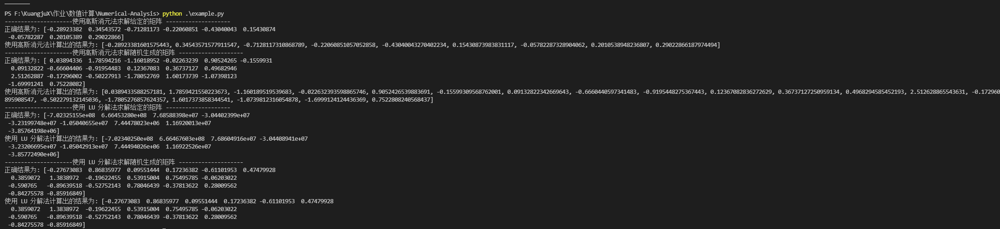

# 线性方程组的直接解法

## 实验内容

1. 编写列主元的通用程序，分别使用给定的矩阵和向量以及自己随机生成的向量进行计算与测试,并输出结果。 即给定矩阵 $A$ 以及向量 $b$, 求解 $Ax = b$
2. 编写使用 LU 分解法求解线性方程组的通用程序，分别使用给定的矩阵和向量以及自己随机生成的向量进行计算与测试，并输出结果及分解的 L, U 矩阵。即给定矩阵 $A$ 以及向量 $b$, 求解 $Ax = b$, 并输出 L, U

## 算法实现

**列主元的高斯消元**的算法实现如下所示:

```python
    # 以列为主元的高斯消元法
    def _gaussian_elimination(self):
        for i in range(0, self.m):
            # 从第 0 行 至最后一行进行消元
            max_element = self.matrix[i][i]
            max_pos = i
            for j in range(i + 1, self.m):
                # 从当前行向后寻找最大的主元
                if self.matrix[j][i] > max_element:
                    max_element = self.matrix[j][i]
                    max_pos = j 
            if max_pos != i:
                # 如果最大的列元素不在当前行，则交换当前行与列元素最大所在行
                # print("max_pos: {}, i: {}".format(max_pos, i))
                self._swap_matrix_row(i, max_pos)
                self._swap_vector_row(i, max_pos)
                # print(self.matrix)
            
            # 交换行之后进行高斯消元
            for k in range(i + 1, self.m):
                # 计算消元系数
                a_k = self.matrix[k][i] / self.matrix[i][i]
                self.matrix[k] -= a_k * self.matrix[i]
                self.vector[k] -= a_k * self.vector[i]
            # print(self.matrix)
        
        # 消元后进行回代
        res = []
        for i in range(0, self.m):
            index = self.m - i - 1
            x = self.vector[index]
            for j in range(0, i):
                yindex = self.m - j - 1
                x -= res[j] * self.matrix[index][yindex]
            x = x / self.matrix[index][index]
            res.append(x)
        res = list(reversed(res))
        return res
```

我们首先遍历所有行，进行消元，在遍历的过程中，我们使用 `max_pos` 用来最大列主元所在的行数，并交换当前行和最大列主元所在行数，在交换行之后进行消元。最后进行回代。

**LU 分解法**的算法实现如下所示:

```python
    # LU 矩阵分解
    def _LU_decomposition(self):
        # 初始化 LU 矩阵
        L = np.array([[0.0 for _ in range(0, self.m)] for _ in range(0, self.m)])
        U = np.array([[0.0 for _ in range(0, self.m)] for _ in range(0, self.m)])

        # 迭代求解 LU 矩阵的系数
        for r in range(0, self.m):
            L[r][r] = 1
            if r == 0:
                U[0] = self.matrix[0]
                for i in range(1, self.m):
                    L[i][0] = self.matrix[i][0] / U[0][0]
            else:
                for i in range(r, self.m):
                    sum = 0
                    for k in range(0, r):
                        sum += L[r][k] * U[k][i]
                    U[r][i] = self.matrix[r][i] - sum
                for i in range(r + 1, self.m):
                    sum = 0
                    for k in range(0, r):
                        sum += L[i][k] * U[k][r]
                    L[i][r] = (self.matrix[i][r] - sum) / U[r][r]
        y = np.linalg.solve(L, self.vector)
        x = np.linalg.solve(U, y)
        return (L, U, x)
```

在 LU 分解法的实现中，我们首先初始化 L, U 矩阵的值，这里一定要初始化成浮点数，不然在稍后计算的时候会出现精度问题。随后我们进行一次迭代，分别求出 L 矩阵与 U 矩阵的项，这里首先需要求出 U 矩阵每一行的值, 之后 L 矩阵再根据这次 U 矩阵求出的值和之前的值计算当前列的值。

## 实验结果分析
下图为我们分别使用列主元的高斯消元法以及 LU 分解法计算给定矩阵以及自己随机生成的非奇异矩阵的结果, 由于 L, U 矩阵的维度较大，因此我们在结果图中没有输出，不过 LU 矩阵的结果也是作为返回值返回的，因此使用者可以自己输出 LU 矩阵的值，可以看到我们的解法相比于正确的解法还是较为准确的，精度也较高(注: 正确结果使用 `numpy.linalg.solve` 进行计算):

