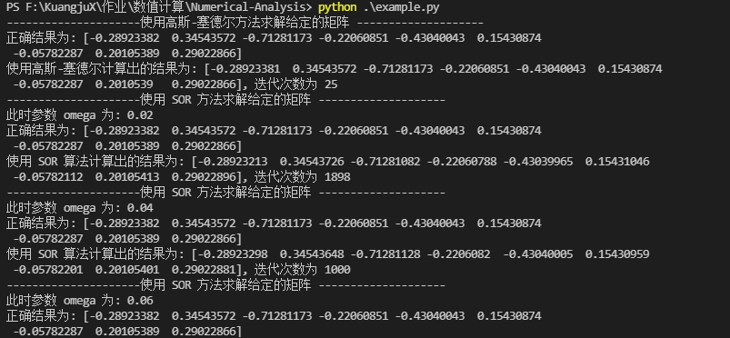

# 线性方程组的迭代解法

## 实验内容
1. 编写高斯-塞德尔迭代和 SOR 迭代的通用程序。  
输入：矩阵 $A$ 和向量 $b$, 迭代初值 $x^0$, 迭代最大步数 $K$, 误差控制 $\epsilon$。对于超松弛迭代，还需输入松弛因子 $\omega$。  
输出：迭代步数及方程 $Ax = b$ 的根值 $x^*$。   
(1) 要求根据给定的矩阵和向量进行测试，取初值 $x^(0)$，误差控制 $\epsilon = 10^{-8}$，打印出两种迭代方法的输出。  
(2) 取松弛因子 $\omega = \frac{i}{50} i = 1, 2, ..., 99$，打印迭代步数，并给一个最佳值。

## 算法实现
高斯-塞德尔算法实现如下所示：
```python
    # 高斯-塞德尔迭代
    def gauss_seidel(self, x0, delta):
        x = x0  
        count = 0
        while True:  
            count += 1
            max_err = 0.0
            for i in range(self.n):
                old_sum = 0.0
                new_sum = 0.0
                for j in range(0, i):
                    new_sum += self.matrix[i][j] * x[j]
                for j in range(i + 1, self.n):
                    old_sum += self.matrix[i][j] * x[j]
                old_xi = x[i]
                x[i] = (self.vector[i] - old_sum - new_sum)/self.matrix[i][i]
                err = abs(old_xi - x[i])
                max_err = max(max_err, err)
            if max_err < delta:
                break
            max_err = 0
        return (x, count)
```
在高斯-塞德尔迭代法中，我们首先将初始向量赋值给 $x$，随后进行迭代，直到计算的0范数小于给定的误差限时返回计算的向量和迭代次数。  
  
SOR 迭代法的实现如下所示：
```python
    def sor(self, x0, omega, delta):
        x = x0  
        count = 0
        while True:  
            count += 1
            max_err = 0.0
            for i in range(self.n):
                old_sum = 0.0
                new_sum = 0.0
                for j in range(0, i):
                    new_sum += self.matrix[i][j] * x[j]
                for j in range(i, self.n):
                    old_sum += self.matrix[i][j] * x[j]
                old_xi = x[i]
                x[i] = x[i] + omega * (self.vector[i] - old_sum - new_sum)/self.matrix[i][i]
                err = abs(x[i] - old_xi)
                max_err = max(max_err, err)
            if max_err < delta:
                break
            max_err = 0
        return (x, count)
```
大体上与 高斯-塞德尔 迭代相同，只不过每次迭代时都要乘上一个给定的系数 $\omega$。

## 实验结果
高斯-塞德尔：   

   
SOR 迭代法：   


实验结果如上图所示，SOR 迭代法的最佳值为 $/omega$ 取 1.18 的时候，此时最小迭代次数为 14
