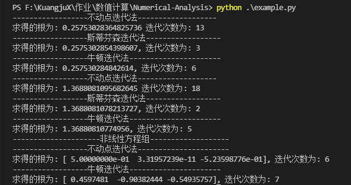

# 非线性方程(组)的数值解法

## 实验内容
1. 编写不动点迭代、斯蒂芬加速迭代和牛顿迭代的通用程序。   
要求：  
(1) 设计一种不动点迭代格式，求解函数 $f(x) = x^2 -3x + 2 -e^x$ 和 $g(x) = x^3 + 2x^2 + 10x - 20$ 的根，要求该迭代格式收敛。然后再使用斯特芬森加速迭代，计算到 $|x_k - x_{k-1}| < 10^{-8}$ 为止。  
(2) 用牛顿迭代，同样计算到 $|x_k - x_{k-1} < 10^{-8}|$。输出迭代初值、迭代次数及各次迭代值，比较方法优劣。 
2. 本章计算实习题3

## 算法实现
不动点迭代的实现如下所示:  
```python
    # 不动点迭代, x0 为初始点, delta 为要求的误差值
    def fixed_iter(self, x0, delta):
        x = x0
        next_x = x0
        count = 0
        while True:
            next_x = self.fn(x)
            err = abs(x - next_x)
            if err < delta:
                break
            else:
                x = next_x
            count += 1
        return (next_x, count)
```
斯蒂芬森迭代法的实现如下所示:
```python
    # 斯蒂芬森迭代法
    def stefenson_iter(self, x0, delta):
        x = x0
        y = x0
        z = x0
        next_x = x0
        count = 0
        while True:
            y = self.fn(x)
            z = self.fn(y)
            next_x = x - ((y - x)*(y - x) / (z - 2*y +x))
            err = abs(next_x - x)
            if err < delta:
                break
            else:
                x = next_x
            count += 1
        return (next_x, count)
```
牛顿迭代法的实现如下:
```python
    # 牛顿迭代法
    def newton_iter(self, x0, delta):
        x = x0
        next_x = x0
        count = 0
        while True:
            next_x = x - (self.fn(x)/derivative(self.fn, x))
            err = abs(next_x - x)
            if err < delta:
                break 
            else: 
                x = next_x
            count += 1
        return (next_x, count)
```
多变量的不动点迭代如下所示:
```python
    # 多变量的不动点迭代
    def vec_fixed_iter(self, x0, delta):
        x = x0 
        next_x = x0
        count = 0
        while True:
            next_x = np.array([self.funcs[i](x) for i in range(len(self.funcs))])
            err = max(abs(x - next_x))
            if err < delta:
                break
            else:
                x = next_x
            count += 1
        return (next_x, count)
```
非线性方程组的牛顿迭代法如下所示:
```python
    # 非线性方程组的牛顿迭代法
    def vec_newton_iter(self, x0, delta):
        x = x0
        next_x = x0
        count = 0
        while True:
            next_x = x - np.dot(self.Jacobian(x), self.Fn(x))
            err = max(abs(next_x - x))
            if err < delta:
                break
            else:
                x = next_x
            count += 1
        return (x, count)
```

## 实验结果
实验结果如下图所示:  

